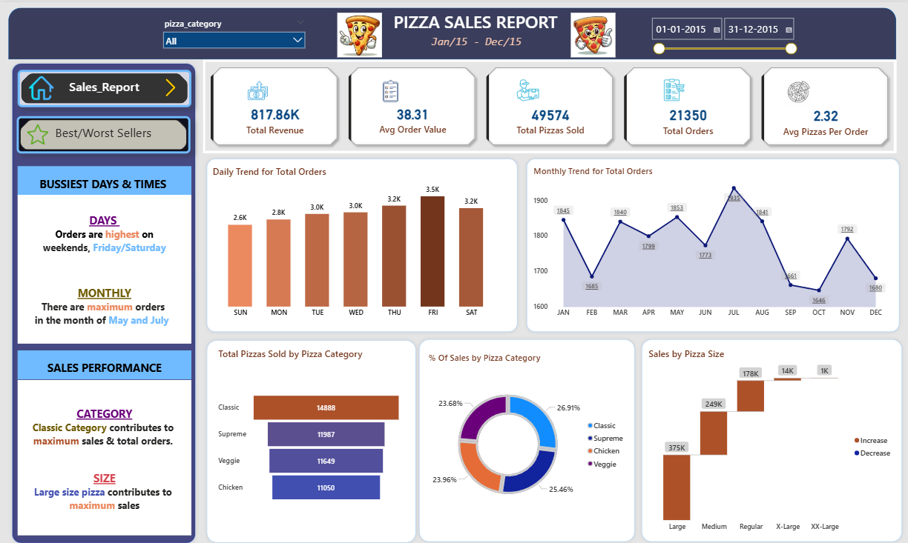
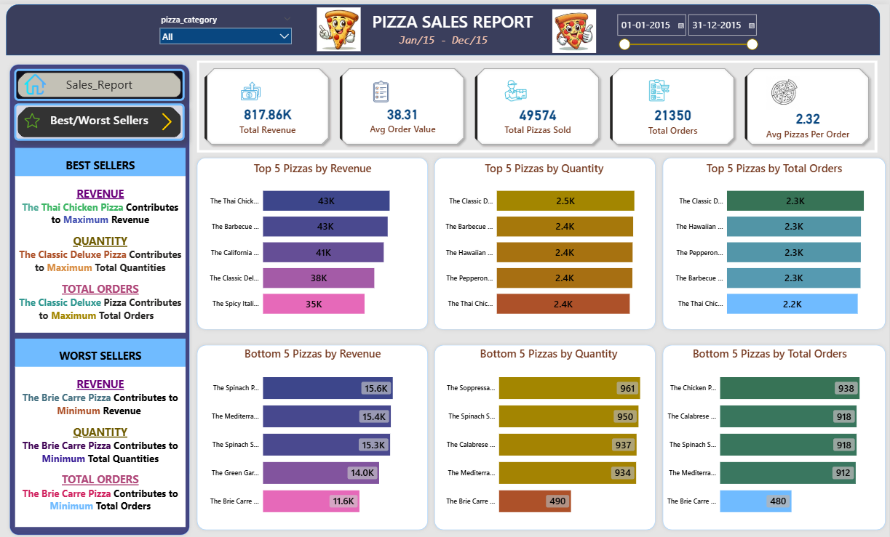

# 🍕 Pizza Sales Analysis Dashboard (MySQL + Power BI)

This repository showcases a full-stack sales analytics project for a pizza restaurant, leveraging robust SQL analysis on real sales data and compelling Power BI dashboards. The project reveals actionable business insights into top- and bottom-performing products, peak sales trends, and key revenue drivers—ideal for business strategy and analytics demonstration.

---

## Table of Contents

- [Project Overview](#project-overview)
- [Dataset Details](#dataset-details)
- [Problem Statement](#problem-statement)
- [Key KPIs & Metrics](#key-kpis--metrics)
- [Dashboard Insights](#dashboard-insights)
- [Visualizations](#visualizations)
- [Files Included](#files-included)
- [Requirements](#requirements)
- [Project Visuals](#project-visuals)
- [Author](#author)

---

## Project Overview

This project delivers an end-to-end analytics pipeline for pizza restaurant sales—integrating data transformation and KPI calculation in MySQL, followed by interactive, business-ready dashboarding in Power BI. The result: clear, visual insights for smarter inventory, marketing, and menu strategies.

---

## Dataset Details

**pizza_sales.csv:**  
A full transactional dataset of all pizza orders, with comprehensive product, order, and revenue attributes.

**Columns include:**
- `pizza_id` – Row identifier  
- `order_id` – Unique order number  
- `pizza_name_id` – Internal pizza code  
- `quantity` – Number of pizzas per line item  
- `order_date` – Date of transaction (DD-MM-YYYY)  
- `order_time` – Time of order (HH:MM:SS)  
- `unit_price` – Price per pizza  
- `total_price` – Revenue for the line (quantity × unit_price)  
- `pizza_size` – S, M, L, XL, XXL  
- `pizza_category` – Chicken, Veggie, Supreme, Classic  
- `pizza_ingredients` – Ingredient list  
- `pizza_name` – Display/menu pizza name  

---

## Problem Statement

**Business Challenge:**  
- Identify revenue-driving and underperforming items  
- Reveal peak sales times for smarter staffing and promotions  
- Optimize the menu by analyzing real sales patterns  
- Support data-driven marketing and inventory decisions  

**Key Questions:**  
- Which pizzas, categories, and sizes generate the most revenue and sell the most units?  
- What are the busiest days and peak months for orders?  
- Who are the best and worst sellers?  
- How can sales performance inform business improvements?  

---

## Key KPIs & Metrics

| KPI                       | Value      | Description                                               |
|---------------------------|------------|-----------------------------------------------------------|
| **Total Revenue**         | 817.86K    | Total sales from all pizza orders                         |
| **Average Order Value**   | 38.31      | Revenue per order                                         |
| **Total Pizzas Sold**     | 49,574     | Total pizza units sold                                    |
| **Total Orders**          | 21,350     | Unique orders placed                                      |
| **Avg. Pizzas Per Order** | 2.32       | Average pizzas per customer order                         |
| **Busiest Days**          | Fri/Sat    | Orders highest on Friday & Saturday                       |
| **Peak Months**           | May, July  | Most orders placed in May and July                        |
| **Top Category**          | Classic    | Classic pizzas lead revenue & quantity                    |
| **Top Size**              | Large      | Large pizzas are the key revenue and sales drivers        |

---

## Dashboard Insights

- **Top Sellers:**  
  - Thai Chicken Pizza (by revenue), Classic Deluxe Pizza (by quantity/orders)
- **Worst Seller:**  
  - The Brie Carre Pizza (across all metrics)
- **Order Trends:**  
  - Fridays/Saturdays and May/July are peak periods
- **Category & Size:**  
  - Classic and Supreme pizzas together account for over half of all revenue  
  - Large pizzas are preferred, reflecting strong customer upsizing/group sales
- **Top & Bottom 5 by Revenue:**  
  - Top: Thai Chicken Pizza, Barbecue Chicken Pizza, California Chicken, Classic Deluxe, Spicy Italian  
  - Bottom: Spinach Pizza, Mediterranean Pizza, Green Garden Pizza, The Brie Carre Pizza

**Strategic Recommendations:**  
- Prioritize best-sellers and large sizes in marketing  
- Review or rework lowest sellers  
- Adjust promotions and staff schedules for weekend and early-summer peaks  

---

## Visualizations

All results are showcased in Power BI dashboards, including:
- **Sales Trends:** Daily/weekly/monthly charts
- **Revenue Distribution:** Category and size via donut/bar charts
- **Performance Breakdown:** Top and bottom performer bar charts
- **KPI Cards:** At-a-glance performance tracking

---

## Files Included

- **pizza_sales.csv** – Complete transactional dataset  
- **Pizza_Sales_SQL_Queries.sql** – All SQL queries for KPI, metrics, and reporting  
- **Problem_Statement_With_SQL_Queries.docx** – Business questions and analytic rationale  
- **Best&Worst_Sellers.png** – Power BI dashboard: best/worst sellers  
- **Sales_Report.png** – Power BI dashboard: main sales trends  

---

## Requirements

- **Database:** MySQL (or compatible engine)
- **Visualization:** Power BI Desktop or Service

---

## Project Visuals

Here are the two key dashboards from Power BI that summarize best/worst performance and overall sales trends:

---

## Author

- **Prerna Birasdar**  
- Email: prernabirasdar506@gmail.com 
- GitHub: [yourusername](https://github.com/yourusername)

---

*For questions or suggestions, connect via email or GitHub. Dive into the data, explore the dashboards, and drive pizza business success!*
